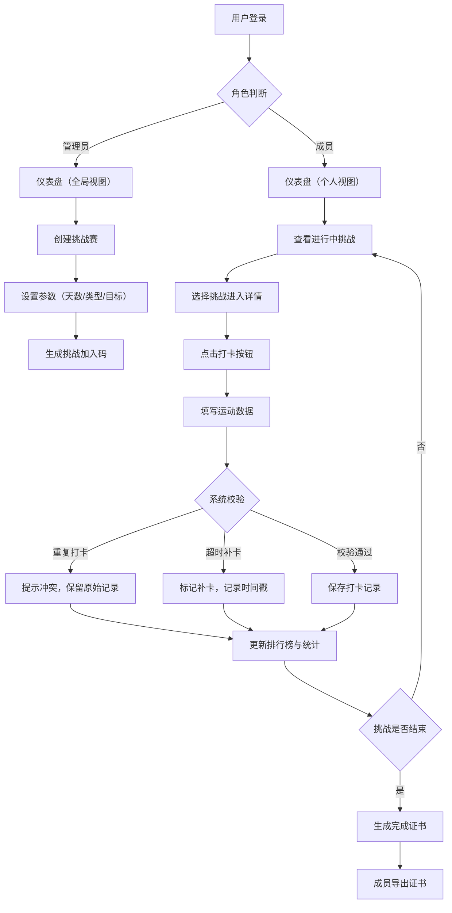

## 1. 产品概述

团队健身打卡与挑战平台，帮助管理员创建运动挑战赛，团队成员参与每日打卡，系统自动统计连续天数、排行榜和完成率。解决团队运动激励不足、数据分散、缺乏可视化追踪的问题。

- 目标用户：企业团队、运动社群、健身俱乐部
- 核心价值：通过游戏化挑战机制提升团队运动参与度和持续性

## 2. 核心功能

### 2.1 用户角色

| 角色 | 注册方式 | 核心权限 |
|------|----------|----------|
| 管理员 | 预设账号/密码登录 | 创建挑战赛、管理成员、导出数据、查看全局统计 |
| 普通成员 | 加入码/账号登录 | 加入挑战、每日打卡、查看排行榜、导出完成证书 |

### 2.2 功能模块

1. **登录/首页仪表盘**：全局统计卡片、进行中挑战列表、快捷打卡入口
2. **挑战赛管理**：创建挑战、查看挑战详情、编辑挑战、结束挑战
3. **打卡中心**：每日打卡表单、历史打卡记录、补卡申请、冲突提示
4. **排行榜**：成员排名、连续天数榜、总时长榜、完成率统计
5. **数据可视化**：趋势图表、完成率饼图、运动类型分布、每日打卡热力图
6. **证书中心**：挑战完成证书预览、PNG/PDF 导出

### 2.3 页面详情

| 页面名称 | 模块名称 | 功能描述 |
|-----------|-------------|---------------------|
| 登录页 | 登录表单 | 角色选择（管理员/成员）、账号密码输入、加入码输入 |
| 仪表盘 | 统计概览 | 总成员数、进行中挑战数、今日打卡率、累计运动时长 |
| 仪表盘 | 我的挑战 | 进行中挑战卡片列表，显示进度条和剩余天数 |
| 仪表盘 | 快捷打卡 | 悬浮打卡按钮，一键打开打卡弹窗 |
| 挑战列表 | 挑战卡片 | 封面图、名称、天数、成员数、状态标签、加入/查看按钮 |
| 挑战详情 | 基本信息 | 挑战名称、描述、起止日期、目标说明 |
| 挑战详情 | 参与成员 | 成员列表及个人进度条 |
| 挑战详情 | 进度统计 | 每日打卡人数趋势图、整体完成率环形图 |
| 创建挑战 | 表单 | 名称、类型、天数、起止日期、目标、封面、描述 |
| 打卡弹窗 | 打卡表单 | 日期选择、运动类型下拉、时长输入、数据字段（距离/组数等）、备注 |
| 打卡弹窗 | 冲突提示 | 重复打卡警告、超时补卡提醒、数据差异对比 |
| 历史记录 | 打卡日历 | 月视图热力图，标记打卡日期 |
| 历史记录 | 记录列表 | 可展开的详细记录，显示原始数据和修改日志 |
| 排行榜 | 排名表格 | 头像、姓名、连续天数、总时长、完成率，支持排序切换 |
| 数据中心 | 多图表 | 趋势折线图、分布饼图、柱状图、热力图 |
| 证书中心 | 证书预览 | 仿真实体证书样式，显示姓名、挑战名、完成数据、签章 |
| 证书中心 | 导出操作 | 一键导出 PNG / PDF 按钮 |

## 3. 核心流程

用户登录后进入仪表盘，查看进行中挑战；选择挑战后进入详情页，点击打卡按钮填写运动数据并提交；系统校验（重复/超时）后给出提示，确认后保存记录；实时更新排行榜和统计图表；挑战结束后成员可在证书中心下载个人完成证书。

## 4. 用户界面设计

### 4.1 设计风格

- **主色**：活力橙 `#FF6B35`（运动/能量感）
- **辅色**：深青蓝 `#2EC4B6`（健康/科技感）
- **中性色**：暖白 `#FAFAF7` 背景，深炭灰 `#2B2B2B` 文字
- **按钮风格**：圆角 12px，悬停阴影上浮，主按钮渐变填充
- **字体**：标题 `Poppins`（无衬线圆润现代感），正文 `Noto Sans SC`
- **布局风格**：卡片式栅格布局 + 侧边栏导航，带渐变分隔
- **图标**：lucide-react 线性图标，统一 18px 尺寸
- **特色**：打卡成功时有彩带微动画，排行榜前三名有金银铜奖章

### 4.2 页面设计概览

| 页面名称 | 模块名称 | UI 元素 |
|-----------|-------------|-------------|
| 登录页 | 登录卡片 | 圆角大卡片，左图右表单，背景运动主题渐变，输入框带图标前缀 |
| 仪表盘 | 统计卡片组 | 4 个彩色渐变统计卡（橙/青/紫/蓝），带图标和增长箭头 |
| 挑战列表 | 挑战卡片 | 图片封面 + 标题 + 进度条 + 状态徽章（进行中/已结束） |
| 挑战详情 | 数据可视化区 | 图表采用青蓝渐变线条，数据点有光晕效果 |
| 打卡弹窗 | 表单弹窗 | 半透明毛玻璃背景，表单区圆角 16px，按钮橙底白字 |
| 排行榜 | 排名行 | 前三名行带金银铜渐变背景色，头像外发光 |
| 证书预览 | 证书组件 | 米白纹理背景，金色装饰边框，手写体签名印章 |

### 4.3 响应式设计

- **桌面优先**（1440px 基准），采用 12 列栅格
- **平板断点**（768px）：侧边栏折叠为顶部汉堡菜单，统计卡 2x2 排列
- **手机断点**（375px）：单列流式布局，排行榜前 3 名突出展示，图表简化
- **触控优化**：移动端按钮高度 ≥ 48px，点击区域扩大 20%
