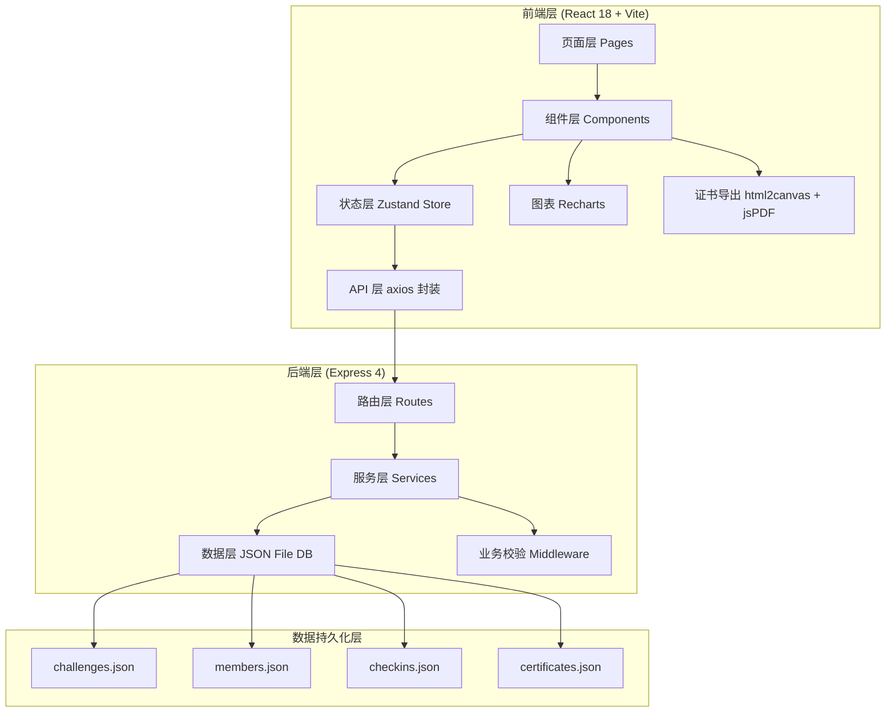
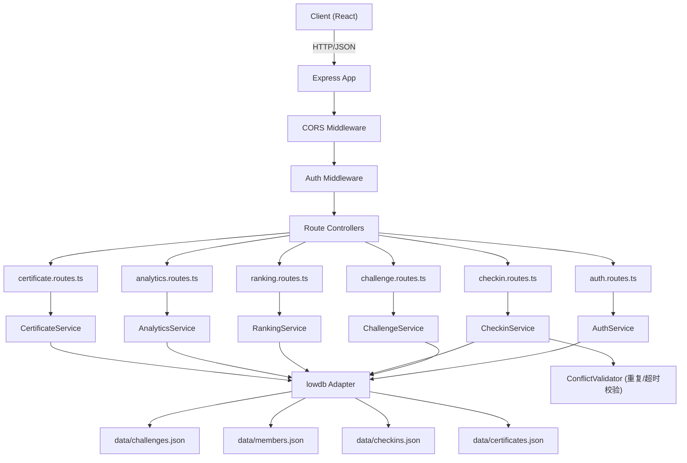
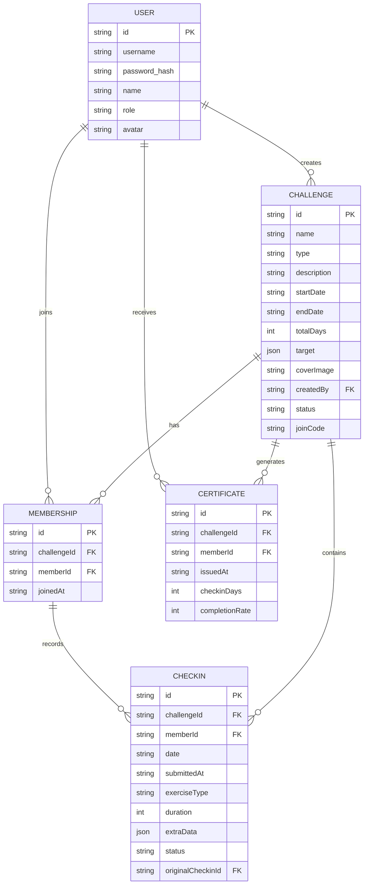

## 1. 架构设计



## 2. 技术描述

- **前端**：React@18 + TypeScript + Vite@5 + TailwindCSS@3
- **状态管理**：Zustand@4（带 persist 中间件本地缓存）
- **UI 组件**：lucide-react 图标库 + 自封装组件
- **图表**：Recharts@2
- **证书导出**：html2canvas + jsPDF
- **后端**：Express@4 + TypeScript + CORS
- **数据库**：JSON 文件存储（lowdb 轻量封装），重启数据完整一致
- **初始化工具**：vite-init（react-express-ts 模板）

## 3. 路由定义

### 前端路由

| 路由路径 | 用途 |
|-----------|------|
| `/login` | 登录页（角色选择） |
| `/dashboard` | 仪表盘首页 |
| `/challenges` | 挑战赛列表 |
| `/challenges/create` | 创建挑战赛（管理员） |
| `/challenges/:id` | 挑战赛详情页 |
| `/checkin` | 打卡中心 + 历史记录 |
| `/ranking` | 排行榜 |
| `/analytics` | 数据可视化分析 |
| `/certificates` | 证书中心 |

### 后端 API 路由

| 方法 | 路径 | 用途 |
|------|------|------|
| POST | `/api/auth/login` | 登录认证 |
| GET | `/api/challenges` | 获取所有挑战列表 |
| GET | `/api/challenges/:id` | 获取挑战详情 |
| POST | `/api/challenges` | 创建挑战（管理员） |
| PUT | `/api/challenges/:id` | 更新挑战（管理员） |
| POST | `/api/challenges/:id/join` | 成员加入挑战 |
| GET | `/api/checkins` | 获取打卡记录列表 |
| POST | `/api/checkins` | 提交打卡（含重复/超时校验） |
| GET | `/api/ranking/challenge/:id` | 获取挑战排行榜 |
| GET | `/api/statistics/challenge/:id` | 获取挑战统计数据 |
| GET | `/api/certificates/:challengeId/:memberId` | 获取证书数据 |

## 4. API 定义（请求响应类型）

```typescript
// 共享类型定义 shared/types.ts
export type UserRole = 'admin' | 'member';

export interface User {
  id: string;
  username: string;
  role: UserRole;
  avatar?: string;
  name: string;
  joinCode?: string;
}

export type ChallengeType = 'running' | 'cycling' | 'swimming' | 'workout' | 'walking' | 'yoga' | 'custom';
export type ChallengeStatus = 'upcoming' | 'active' | 'ended';

export interface Challenge {
  id: string;
  name: string;
  type: ChallengeType;
  description: string;
  startDate: string;
  endDate: string;
  totalDays: number;
  target: {
    minDurationPerDay: number; // 分钟
    extraField?: string; // 如 distance, sets 等
  };
  coverImage?: string;
  createdBy: string;
  createdAt: string;
  status: ChallengeStatus;
  joinCode: string;
  memberIds: string[];
}

export type CheckinStatus = 'normal' | 'late' | 'duplicate_warning';

export interface Checkin {
  id: string;
  challengeId: string;
  memberId: string;
  date: string; // YYYY-MM-DD
  submittedAt: string; // ISO 时间戳
  exerciseType: ChallengeType;
  duration: number; // 分钟
  extraData?: {
    distance?: number; // km
    sets?: number;
    calories?: number;
    steps?: number;
  };
  note?: string;
  status: CheckinStatus;
  originalCheckinId?: string; // 关联重复打卡的原始记录
  conflictResolution?: 'keep_original' | 'overwrite';
}

export interface RankingItem {
  memberId: string;
  memberName: string;
  avatar?: string;
  consecutiveDays: number;
  totalDuration: number;
  totalCheckins: number;
  completionRate: number; // 0-100
  rank: number;
}

export interface CertificateData {
  id: string;
  challengeId: string;
  challengeName: string;
  memberId: string;
  memberName: string;
  issuedAt: string;
  totalDays: number;
  checkinDays: number;
  completionRate: number;
  totalDuration: number;
  achievement: string;
}

export interface ApiResponse<T> {
  success: boolean;
  data?: T;
  error?: {
    code: string;
    message: string;
    details?: any;
  };
}

// 打卡冲突响应
export interface CheckinConflictResponse {
  conflictType: 'duplicate' | 'late';
  message: string;
  existingRecord?: Checkin;
  submittedData: Partial<Checkin>;
  suggestedAction: 'keep_original' | 'mark_late' | 'confirm_submit';
}
```

## 5. 服务器架构图



## 6. 数据模型

### 6.1 数据模型 ER 图



### 6.2 JSON 数据结构初始化

```json
// data/users.json - 初始数据
{
  "users": [
    {
      "id": "admin_001",
      "username": "admin",
      "password": "admin123",
      "name": "系统管理员",
      "role": "admin",
      "avatar": "https://api.dicebear.com/7.x/avataaars/svg?seed=admin"
    },
    {
      "id": "mem_001",
      "username": "zhangwei",
      "password": "123456",
      "name": "张伟",
      "role": "member",
      "avatar": "https://api.dicebear.com/7.x/avataaars/svg?seed=zhangwei"
    },
    {
      "id": "mem_002",
      "username": "lina",
      "password": "123456",
      "name": "李娜",
      "role": "member",
      "avatar": "https://api.dicebear.com/7.x/avataaars/svg?seed=lina"
    },
    {
      "id": "mem_003",
      "username": "wanghao",
      "password": "123456",
      "name": "王浩",
      "role": "member",
      "avatar": "https://api.dicebear.com/7.x/avataaars/svg?seed=wanghao"
    }
  ]
}
```
